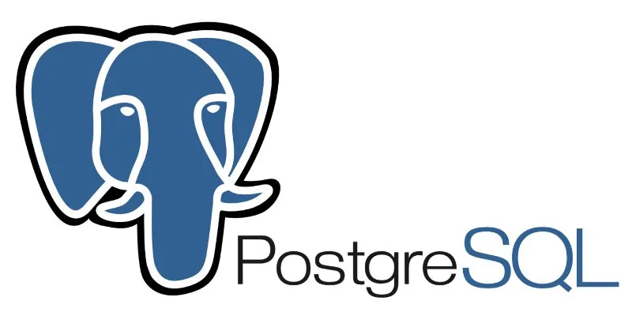

# Django_Tutorial - MentalMuse App
Creating the Django Version of my MentalMuse App.
previous version was developed with Streamlit
Tech Stack:
React, Django, AWS
## Installing Django

## Summary of each topic
### Chapter 1: Creating a Django Project

Responsibilities of backend developers
The backend is typically made of three major parts:
- Server: A machine or an application (NGINX) that receives requests
- Application: A running application on the server that receives the requests, validates these requests, and sends an appropriate response
- Database: Used to store data
The responsibilities of backend programmers could easily involve writing APIs, writing code to interact with a database, creating modules or libraries, also working on business data and architecture, and much more.
They also have to do the following:
- Coordinate and communicate with frontend developers to transfer data efficiently to the client side of the application
- Collaborate with quality assurance engineers to optimize the server-side processes and also pass some security checks
- Optimize the application when the number of requests or users scales as well
- Analyze the requirements of the project and create a simple structure to handle bugs and errors
- Propose efficient solutions for cloud hosting but also build CI/CD pipelines

The backend architecture actually helps build one of the most common interfaces for consuming data in the software industry: an Application Programming Interface (API).
Web APIs are relatively common and there are different specifications and protocols. The goal of API specification is to standardize—because of different programming languages and different Operating Systems (OSs)—exchanges between two or more web services.
For example, you’ll find the following:
1. Remote Procedure Call (RPC): A protocol that can be used by a program to request a service 
from a program on another computer on a network that it does not need to know the details
of. This is sometimes called a function or subroutine call.
What is an API? 7
2. Simple Object Access Protocol (SOAP): An XML-based communication protocol that 
allows applications to exchange information with each other over HTTP. It therefore allows 
access to web services and the interoperability of applications across the web. SOAP is a 
simple and lightweight protocol that relies entirely on established standards such as HTTP 
and XML. It is portable and therefore independent of any OS and type of computer. SOAP is 
a non-proprietary specification.
3. REST/RESTful: A style of architecture for building applications (web, intranet, or web service). 
This is a set of conventions and best practices to be observed, not a technology in its own 
right. The REST architecture uses the original specifications of the HTTP protocol, rather than 
reinventing an overlay (as SOAP or XML-RPC do, for example):
- Rule 1: The URL is a resource identifier
- Rule 2: HTTP verbs are identifiers of operations
- Rule 3: HTTP responses are representations of resources
- Rule 4: Links are relations between resources
- Rule 5: A parameter is an authentication token

-----------
### Chapter 2:Authentification and Authorization using JWTs
Models, serializers, and viewsets are used create APIs that can receive HTTP requests as well as return a response. 
This will be done by building an authentication and authorization system using JSON Web Tokens (JWTs) to allow users to create an account, log in, and log out.

According to RFC 7519, a JWT is a JSON object defined as a safe way of transmitting information 
between two parties. Information transmitted by JWT is digitally signed so it can be verified and trusted.
A JWT contains three parts—a header (x), a payload (y), and a signature (z)—that are separated 
by a dot:
xxxxx.yyyyy.zzzzz
- Header - The header of the JWT consists of two parts: the type of token and the signing algorithm being 
used. The signing algorithm is used to ensure that the message is authentic and not altered.
- Payload - The payload is the second part that contains the claims.According to the official JWT 
documentation (https://jwt.io/introduction), claims are statements about an 
entity (typically, the user) and additional data.
- Signature - The signature of a JWT is the encoded header, the encoded payload plus a secret, and an 
algorithm specified in the header, all of them combined and signed

Each time a user successfully logs in, a JWT is created and returned. The JWT will be represented as credentials used to access protected resources. The fact that it’s possible to store data in a JWT makes it vulnerable. That’s why you should specify an expiration time when creating a JWT.
JWTs used to access resources (access tokens) should have a short lifespan. This means that after the JWT has expired, 
the user has to log in again and again – and no user wants the login page to appear every 5 minutes.
That’s where a refresh token is useful. It’ll contain the essential information needed to verify the user 
and generate a new access token
-----
DJANGO DATABASE
Django models provide object-relational mapping (ORM) to the underlying database. ORM is a 
tool that simplifies database programming by providing a simple mapping between the object and 
the database. Then, you don’t necessarily need to know the database structure or write complex SQL 
queries to manipulate or retrieve data from the database.
Writing models with Django comes with several advantages:
- Simplicity: Writing queries in Python may not be as clear as writing in SQL, but it’s less error prone and more efficient, as you don’t have to control which type of database you are working with before trying to understand the code.
- Consistency: SQL is inconsistent across different databases. Working with Django models creates an abstraction and helps you focus on the most important tasks.
- Tracking: It’s even easier to track database design changes working with Django models. It’s done by reading migration files written in Python. We’ll discuss this more in the next chapter

Notice that you also have access to model managers. Django Manager is a class that behaves as an interface through which Django models interact with databases. Every Django model, by default, inherits the models.Manager class that comes with the necessary methods to make Create, Read, Update and Delete (CRUD) operations on the table in the database.

-------
### Chapter 3:Social Media Post Management
--------
### Chapter 4:Adding Comments to Social Media Posts

Chapter 5:Testing the REST Api

Chapter 5:
Chapter 5:
Chapter 5:
Chapter 5:
Chapter 5:
Chapter 5:

#creating a virtual environment
pip install --user virtualenv
#starting the virtual environment
python -m venv venv
